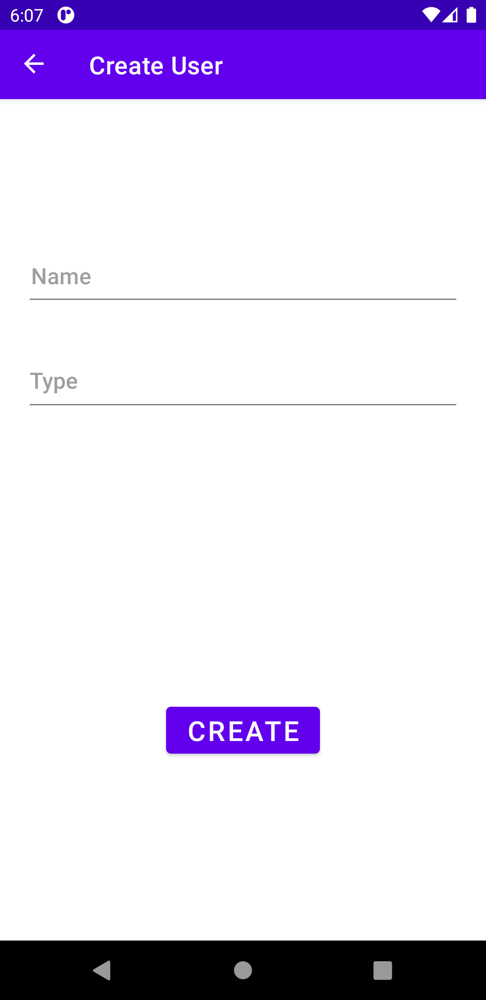

## Kotlin MVVM Architecture

A sample app that display list of Random User. The purpose of this project to illustrate the usage of MVVM architecture design pattern that follow the best practices of Object Oriented Design Patterns using the following technology stack.

1. Architecture Design Pattern
2. MVVM
3. Live Data
4. Room Database
5. Retrofit
6. Repository Pattern
7. AndroidX
8. Glide
9. Github User API
10. JetPack Libraries

## ScreenShots

## Architecture

## Author
[Ajay Gujja](https://github.com/ajaygujja "Ajay Gujja")

## Sources
 1. [Google's official doc](https://developer.android.com/jetpack/docs/guide)
 2. [Google's Codelab](https://codelabs.developers.google.com/codelabs/android-training-livedata-viewmodel/#0)
 2. [Architecture Components Samples](https://github.com/android/architecture-components-samples/tree/88747993139224a4bb6dbe985adf652d557de621)
 3. [Jose Alcérreca's post at Medium](https://medium.com/androiddevelopers/livedata-beyond-the-viewmodel-reactive-patterns-using-transformations-and-mediatorlivedata-fda520ba00b7)